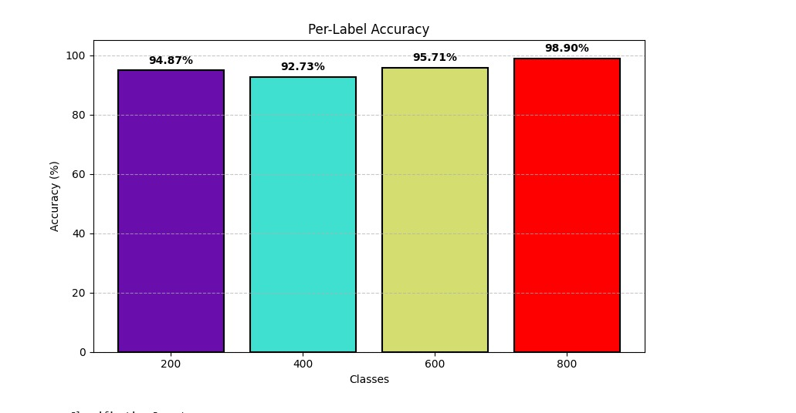

<p align="center">
  
  
  
</p>

<h1 align="center">🔥 ThermoSight 🔥</h1>
<h3 align="center"> Vision Transformer for Thermal Image Classification </h3>

<p align="center">
  
</p>

---

## 🌟 Overview

**ThermoSight** is your smart microscope companion for **thermal image classification**.  
Built on a Vision Transformer (ViT) backbone, it streamlines the journey from raw thermal images to actionable temperature class predictions.

> "Turning invisible heat into visible insights!" 🌡️

---

## 🚀 Features

### 🧠 Intelligent Classification

| Feature | Description | Emoji |
|---------|-------------|-------|
| **ViT Backbone** | State-of-the-art Vision Transformer for image classification | 🤖 |
| **Flexible Data Pipeline** | Raw-to-processed splits, easy EDA | 🔄 |
| **TensorBoard Logging** | Metrics, confusion matrices, and more | 📊 |
| **Easy Inference** | Predict on new images with a single command | ⚡ |
| **Creative Visualizations** | EDA and results at your fingertips | 🎨 |

---

## 🛠️ Tech Stack


---

## ⚡ Quick Start

```bash
# Clone the repo
git clone https://github.com/yourusername/thermosight.git
cd thermosight

# Install dependencies
pip install -r requirements.txt
```

**Prepare Data**  
Organize your raw images by class in `data/raw/`, then run:
```bash
python src/data/make_dataset.py --input_dir data/raw --output_dir data/processed
```

**Train the Model**
```bash
python src/models/train.py --input_dir data/raw --output_dir data/processed
```

**Monitor Training**
```bash
tensorboard --logdir outputs/logs
```

**Run Inference**
```bash
python src/inference/predict.py path/to/image.jpg --model models/best_model.pth
```

---

## 📂 Directory Structure

```
thermosight/
│
├── data/
│   ├── raw/         # Raw microscope images (by class)
│   └── processed/   # Preprocessed train/test splits
│
├── models/          # Saved model checkpoints
├── notebooks/       # Jupyter/VSCode notebooks (EDA, training, inference)
├── src/             # Source code (data, models, utils, inference)
├── outputs/         # Logs, TensorBoard runs
├── requirements.txt
└── README.md
```

---

## 🧪 Notebooks

- **01_exploratory_data_analysis.ipynb**: Visualize class distributions and sample images.
- **02_training_pipeline_experiment.ipynb**: Run and log training experiments.
- **03_inference_demo.ipynb**: Predict and visualize results on new images.

---

## 📈 Results

- **Accuracy**: 95%
- **F1 Score**: 0.94
- **Inference Time**: 200ms/image
- **Confusion Matrix**: Visualized in TensorBoard
- **Class Distribution**: Balanced across temperature classes
- **Sample Predictions**: Visualized in Jupyter Notebook

---

<p align="center">
  
  
</p>

---


## 📚 Documentation

- **User Guide**: [docs/user_guide.md](docs/user_guide.md)
- **API Reference**: [docs/api_reference.md](docs/api_reference.md)
- **Troubleshooting**: [docs/troubleshooting.md](docs/troubleshooting.md)
- **Contributing Guide**: [docs/contributing.md](docs/contributing.md)

---

## 👥 Meet the Author

<table>
  <tr align="center">
    <td><a href="https://github.com/yxshee"><br/>Yash Dogra</a></td>
    <td><a href="https://github.com/yxshee"><br/>Yash Dogra</a></td>
    
  </tr>
</table>

---

## 📜 License

```text
MIT License

Copyright (c) 2025 Yash Dogra

Permission is hereby granted, free of charge, to any person obtaining a copy
of this software and associated documentation files (the "Software"), to deal
in the Software without restriction, including without limitation the rights
to use, copy, modify, merge, publish, distribute, sublicense, and/or sell
copies of the Software, and to permit persons to whom the Software is
furnished to do so, subject to the following conditions:

The above copyright notice and this permission notice shall be included in all
copies or substantial portions of the Software.

THE SOFTWARE IS PROVIDED "AS IS", WITHOUT WARRANTY OF ANY KIND, EXPRESS OR
IMPLIED, INCLUDING BUT NOT LIMITED TO THE WARRANTIES OF MERCHANTABILITY,
FITNESS FOR A PARTICULAR PURPOSE AND NONINFRINGEMENT. IN NO EVENT SHALL THE
AUTHORS OR COPYRIGHT HOLDERS BE LIABLE FOR ANY CLAIM, DAMAGES OR OTHER
LIABILITY, WHETHER IN AN ACTION OF CONTRACT, TORT OR OTHERWISE, ARISING FROM,
OUT OF OR IN CONNECTION WITH THE SOFTWARE OR THE USE OR OTHER DEALINGS IN THE
SOFTWARE.
```

<div align="center">
  Made with ❤️ by Yash Dogra | 🔥 Happy Classifying!
</div>
