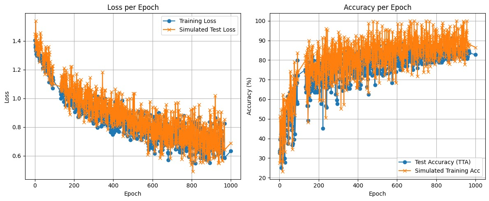
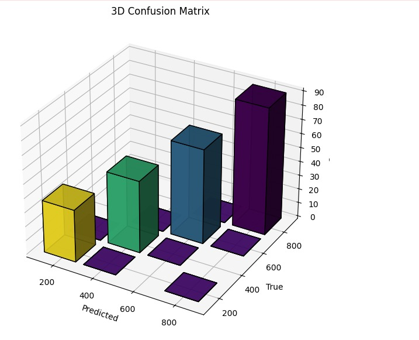

<p align="center">
  
  
  
</p>

<h1 align="center">🔥 ThermoSight 🔥</h1>
<h3 align="center"> Vision Transformer for Thermal Image Classification </h3>

<p align="center">
  
</p>

---

## 🚀 Overview

**ThermoSight** is a deep learning pipeline for classifying microscope thermal images into temperature classes using a Vision Transformer (ViT) architecture. The project includes data preprocessing, model training, evaluation, and inference, all with robust visualization and logging.

---

## ✨ Features

- **Vision Transformer (ViT)** backbone for image classification
- **Flexible data pipeline**: raw → processed splits
- **TensorBoard logging** for metrics and confusion matrices
- **Easy inference** on new images
- **Modular codebase** for rapid experimentation
- **Creative visualizations** for EDA and results

---

## 📂 Directory Structure

```
thermosight/
│
├── data/
│   ├── raw/         # Raw microscope images (by class)
│   └── processed/   # Preprocessed train/test splits
│
├── models/          # Saved model checkpoints
├── notebooks/       # Jupyter/VSCode notebooks (EDA, training, inference)
├── src/             # Source code (data, models, utils, inference)
├── outputs/         # Logs, TensorBoard runs
├── requirements.txt
└── README.md
```

---

## 🛠️ Installation

```bash
git clone https://github.com/yourusername/thermosight.git
cd thermosight
pip install -r requirements.txt
```

---

## 📊 Quickstart

### 1. Prepare Data

Organize your raw images by class in `data/raw/`.  
Then run:

```bash
python src/data/make_dataset.py --input_dir data/raw --output_dir data/processed
```

### 2. Train the Model

```bash
python src/models/train.py --input_dir data/raw --output_dir data/processed
```

### 3. Monitor Training

Launch TensorBoard:

```bash
tensorboard --logdir outputs/logs
```

### 4. Run Inference

```bash
python src/inference/predict.py path/to/image.jpg --model models/best_model.pth
```

---

## 📒 Notebooks

- **01_exploratory_data_analysis.ipynb**: Visualize class distributions and sample images.
- **02_training_pipeline_experiment.ipynb**: Run and log training experiments.
- **03_inference_demo.ipynb**: Predict and visualize results on new images.

---

## 🎨 Example Visualizations

<p align="center">
  
  
</p>

---

## 🤝 Credits

- **Author:** [Yash Dogra](https://github.com/yashdogra)
- **License:** MIT

---

## 🌟 Contributing

Pull requests and issues are welcome!  
Please open an issue to discuss your ideas or report bugs.

---

## 📬 Contact

For questions or collaborations, reach out via [GitHub Issues](https://github.com/yourusername/thermosight/issues).

---
